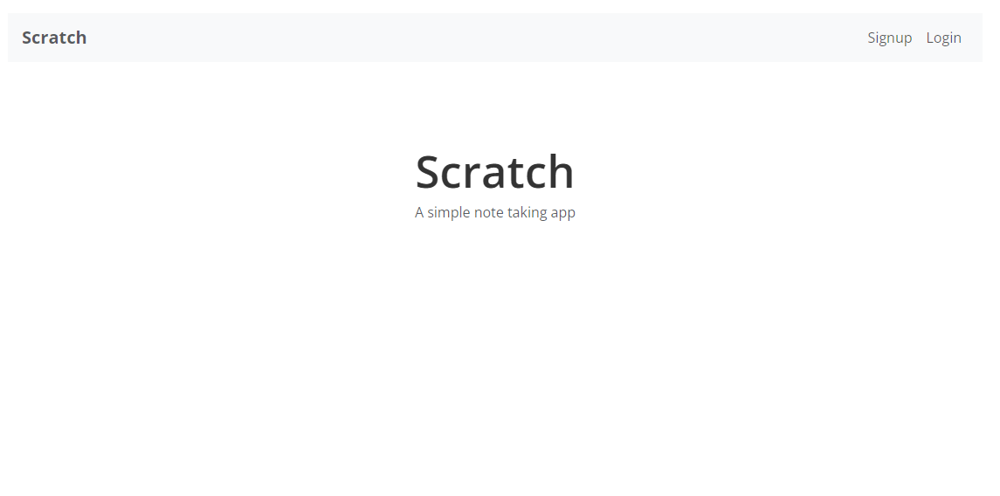

## Note App Demo

The demo app is a single page application powered by a serverless API written completely in TypeScript.

It's my practice project for React, so there may be some mistakes, and the implements partly comes from the sst-dev's [guide](https://sst.dev/guide).

## Features:

- Allow users to signup and login to their accounts
- Users should be able to create notes with some content
- Each note can also have an uploaded file as an attachment
- Allow users to modify their note and the attachment
- Users can also delete their notes
- The app should be able to process credit card payments
- App should be served over HTTPS on a custom domain
- The backend APIs need to be secure
- The app needs to be responsive

## Technologies & Services

- Bootstrap for the UI Kit
- Certificate Manager for SSL
- CloudFront for serving out our app
- Cognito for user authentication and securing our APIs
- DynamoDB for our database
- GitHub for hosting our project repos
- Lambda & API Gateway for our serverless API
- React Router for routing
- React.js for our single page app
- Route 53 for our domain
- S3 for hosting our app and file uploads
- Seed for automating serverless deployments
- Stripe for processing credit card payments

## Requirements

- Node v18+ installed on your machine.
- PNPM v8+ installed on your machine.
- A free GitHub account.
- Basic knowledge of JavaScript and TypeScript.
- And basic knowledge of how to use the command line.

## Run

1. run `pnpm sst dev` in root path;
2. in another terminal tab, run `pnpm run dev` in packages/frontend directory;
3. navigate to the ApiEndpoint link in browser, the link is in the output of the first terminal tab;
